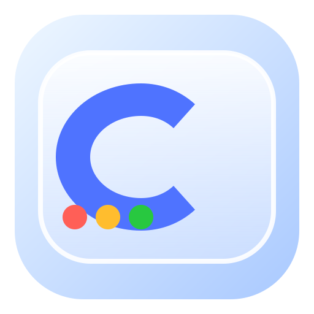

# CarsonDock

  

  <strong>A lightweight, macOS-inspired launcher for Android.</strong> 
  A desktop-style home experience built with Kotlin and Jetpack Compose.

> 🚧 **Early development** — CarsonDock is now running its first real launcher UI. The dock, app discovery, and Android launcher integration are being built incrementally.

## 🖥️ Current build

The first UI foundation includes:

- 🌌 Desktop-style gradient workspace
- 🍎 macOS-inspired top menu bar
- 🪟 Translucent rounded dock
- 📱 Automatic discovery of installed launcher apps
- 🚀 Tap-to-launch dock apps
- 🔎 Search-style control placeholder
- 🏠 Android HOME/DEFAULT launcher integration

## ✨ Roadmap

- [x] Initial Android project
- [x] Launcher activity
- [x] Desktop-style UI
- [x] Basic dock
- [x] Installed-app discovery
- [x] Launch apps from the dock
- [x] GitHub Actions APK builds
- [ ] Full Launchpad app grid
- [ ] Spotlight-style search
- [ ] Real app icons in the dock
- [ ] Dock magnification
- [ ] Custom wallpapers
- [ ] Desktop folders
- [ ] Android widgets
- [ ] Dock customization
- [ ] Settings app
- [ ] Tablet/foldable layouts

## 🛠️ Tech

CarsonDock is built with **Kotlin**, **Jetpack Compose**, and standard Android launcher APIs.

The current application targets Android 15 / API 35 and supports Android 8.0+ (API 26+).

## 📦 Build an APK

CarsonDock has a GitHub Actions workflow at `.github/workflows/build-apk.yml`.

It runs automatically on pushes to `main`, and can also be started manually from the **Actions** tab with **Build APK → Run workflow**.

When the build succeeds, GitHub uploads the debug APK as the **CarsonDock-debug-apk** workflow artifact.

## 🎨 Icon

The current CarsonDock icon is an original project asset and is a candidate for the future app icon. Its final use can change as the launcher design evolves.

## 🚀 Development

1. Clone the repository.
2. Open it in Android Studio.
3. Let Gradle sync the project.
4. Build and run the `app` module on an Android device or emulator.
5. Select CarsonDock as the device's default Home app to test the launcher behavior.

## 📜 License

License information will be added as the project develops.

---

**CarsonDock** — a desktop-inspired Android launcher, built from scratch. 🍎✨
